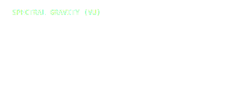
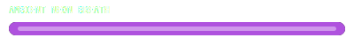
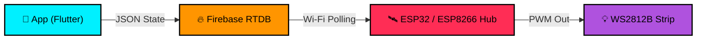

  

## 🌌 Overview
**Aurora Pixel Controller** is a professional hardware control interface designed for robust LED management. Featuring a pure AMOLED-black aesthetic and high-fidelity hardware simulation, this project provides a premium structural environment for local and remote LED installations.

---

## 🛰️ Project Status: v1.0.0 Stable (Hardware Sync Ready)

> [!IMPORTANT]  
> This project has officially exited Beta and is now in **Production Stable** status.
> - **Backend Connected**: Fully operational integration with Firebase Realtime Database for instantaneous hardware execution.
> - **In-App Firmware Extraction**: Production-certified C++ firmwares for ESP32 and ESP8266 are deeply embedded within the application. Users can grab the `.ino` files directly from the in-app Firmware Centre.

---

## ⚡ High-Fidelity Simulation System

Aurora doesn't just send values; it mathematically simulates the hardware. 

### 📉 Gravity Drop (VU Mode)
*Physics-based peak audio detection computing precise weight-drop release intervals.*

  

### ☄️ Meteor Shower (Pixel Mode)
*Asynchronous streaking light pulses using continuous decay (`fadeToBlackBy`) algorithms.*

  

### 🧘 Neon Pulse (Ambient Mode)
*Rhythmic timeline loops designed for structural immersion.*

  

---

## 🚀 Recent Updates (v1.0.0 Stable)

Built to enforce maximum reliability across both the digital layout and physical networks:

- **App-Based Hardware Firmwares**: Eradicated traditional GitHub dependency downloading. Fully functioning `FastLED` ESP32 and ESP8266 firmwares are packed tightly into the app's `assets/firmwares/` directory for direct extraction.
- **Firebase Synchronicity**: Engineered constant structural syncing. Variables like Active Animation, Color Hex, and Power natively map to identical Firebase pathways parsed safely by the ESP.
- **Advanced Topology Safeguards**: Overhauled Android Accessibility font-scaling logic. Typography is mathematically halted via `textScaleFactor`, ensuring UI layouts cannot geometrically break.
- **Legacy Haptic Engineering**: Stripped third-party vibration plugins that failed to fire on budget OEM partitions, re-routing tactile cues to universally supported Android core constants.
- **Branding Architecture**: Secured global product identity by rendering multi-density Android icons (`mdpi` through `xxxhdpi`).

---

## 🛠️ System Architecture

---

## 🚀 Installation
1.  **Clone Source**: `git clone https://github.com/kiran-embedded/aurora-pixel-controller.git`
2.  **Initialize**: Run `flutter pub get`
3.  **Config Database**: Integrate your own `firebase_options.dart`.
4.  **Hardware Deploy**: Access the Firmware Centre in the app, paste your WiFi/DB identifiers into the code, and flash your ESP.

---

## 👨‍💻 Engineering

Maintained by **[kiran-embedded](https://github.com/kiran-embedded)**

## 📄 License
MIT License. See `LICENSE` for more information.
