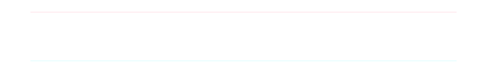
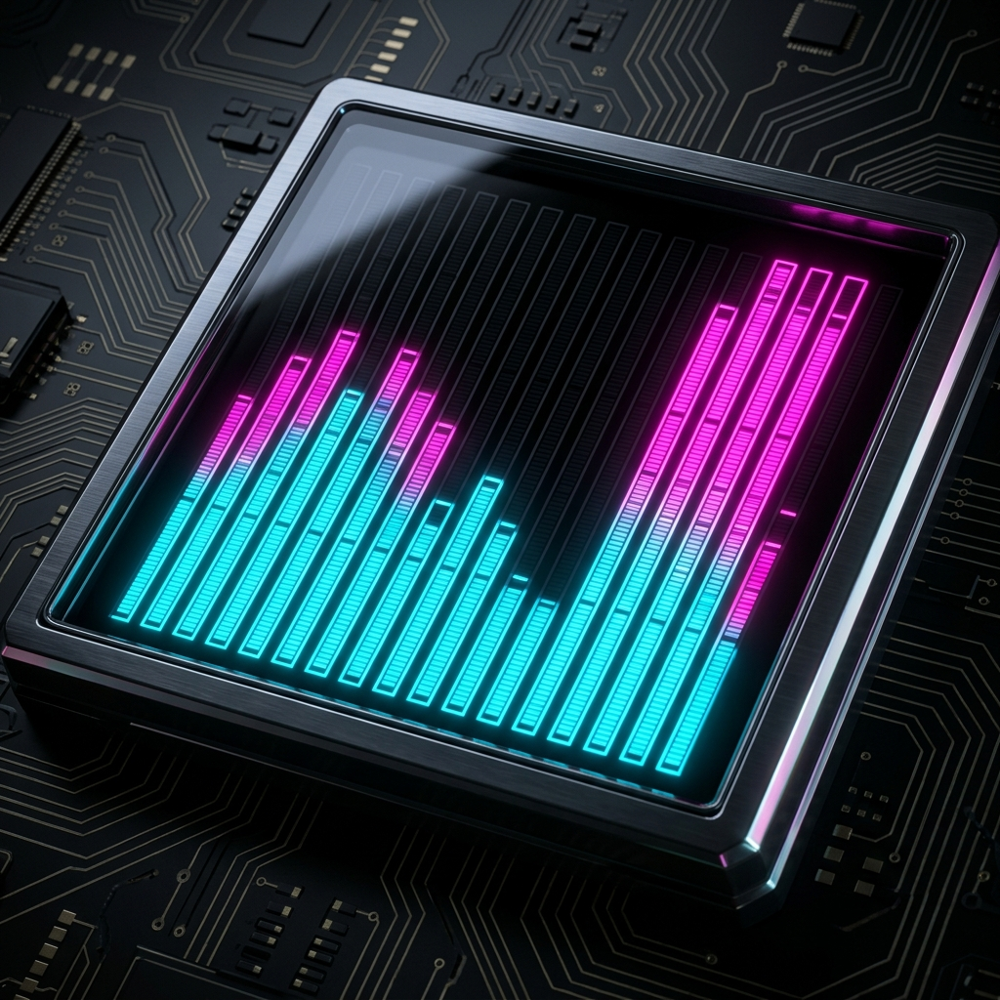
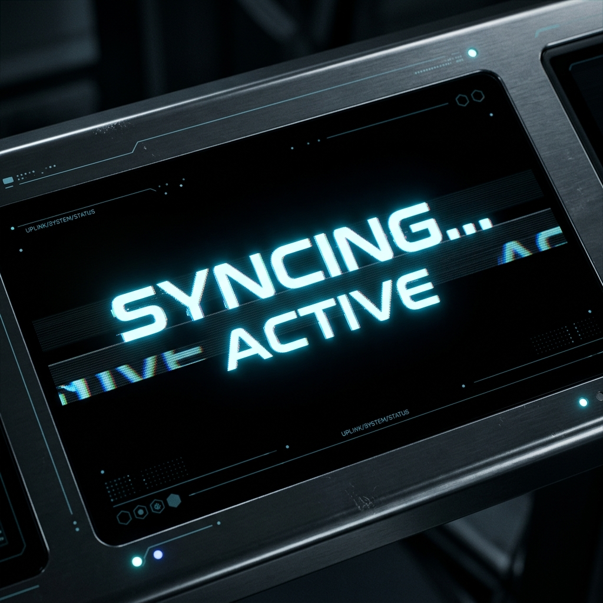
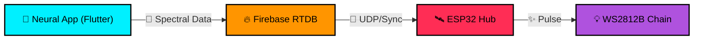

  

## 🌌 Overview
**Aurora Pixel Controller** is a premium, Cyber-Industrial interface designed for the next generation of LED control. Highlighting a fusion of AMOLED-black aesthetics and spectral audio-reactive visualization, this project delivers an elite "Pro Studio" feel to local and remote LED management.

---

## 🛰️ Project Status: Beta (Pre-Backend)

> [!IMPORTANT]  
> This project is currently in a **Frontend-Only Beta** state.
> - **Started, Not Finished**: The visual core and simulation engines are complete, but full hardware integration is ongoing.
> - **Current Phase**: Finalizing the Neural Logic bridge for Firebase and ESP32.

---

## ⚡ Key Experience

### 🎭 Visual Simulation Hub
We prioritize a "Simulation-First" approach, allowing you to design and preview animations before they hit the physical strip.

  
  

---

## 🚧 Development Roadmap

The path from a high-end UI to a fully-synced Hardware Ecosystem:

- [ ] **Phase 1: Neural Backend [HIGH PRIORITY]**
  - **Bridge to Hardware**: Implement the bi-directional Firebase Realtime Database pipeline.
  - **State Injection**: Connect `HardwareState` to physical ESP32 JSON updates.
- [ ] **Phase 2: Advanced Creative FX**
  - **Spectral Core**: Develop advanced, multi-layer creative animations (e.g., *Neural Drift*, *Void Pulse*).
  - **Custom Shaders**: Implement Skia-based shaders for more organic "water-flow" effects.
- [ ] **Phase 3: Hardware Expansion**
  - **OTA Bridge**: Deploy firmware updates directly from the Setup tab via modern OTA protocols.
  - **Multi-Strip Control**: Manage multiple ESP32 hubs from a single neural dashboard.

---

## 🛠️ Technical Architecture

---

## 🚀 Installation
1.  **Clone Source**: `git clone https://github.com/kiran-embedded/aurora-pixel-controller.git`
2.  **Initialize**: `flutter pub get`
3.  **Deploy**: Inject your Firebase config and `flutter run`.

---

## 👨‍💻 Engineering

Crafted in the neon grid by **[kiran-embedded](https://github.com/kiran-embedded)**

## 📄 License
MIT License. See `LICENSE` for more information.
