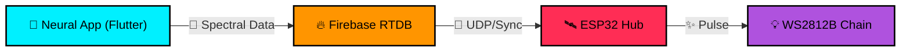

<p align="center">
  
</p>

# 🌌 Aurora Pixel Controller
### Ultra-Premium Cyberpunk LED Engine | ESP32 & WS2812B

[](https://github.com/kiran-embedded)
[](LICENSE)
[](https://github.com/kiran-embedded)

**Aurora Pixel Controller** is an elite, AMOLED-optimized interface engineered for high-fidelity control of WS2812B LED ecosystems. Driven by a Flutter-Firebase-ESP32 pipeline, it delivers zero-latency configuration and real-time spectral visualization within a meticulously crafted Cyber-Industrial design language.

---

## ⚡ Simulation Experience

We don't just control LEDs; we simulate the entire industrial aesthetic in real-time.

<p align="center">
  
  
</p>

- **🖥️ Spectral Extraction**: Witness precise audio-reactive bars with physics-based damping.
- **📟 Neural Interface**: Modern "Cyber-Glitch" text animations for system status and configuration updates.

---

## 💎 Key Features

- **🛡️ Hardened Cyber UI**: A non-scrollable, rigid glassmorphism architecture optimized for OLED depth.
- **🌀 Spectral Engines**:
  - **Dynamic FX**: 12+ premium algorithms including *Aurora Borealis*, *Neon Breath*, and *Cyber Sweep*.
  - **Audio React (VU)**: High-resolution spectral mapping with *Gravity Drop* and *Digital Wave* logic.
- **🛰️ Firebase Bridge**: Global remote synchronization over Realtime Database with near-instant state deployment.
- **📟 Hyper-Realistic Simulation**: On-device LED strip visualization featuring specular highlights and staggered diode behavior.
- **🎨 Spectral Hub**: 360-degree Hue-rotation engine with precise 16-bit Hex channel control.

---

## 🛠️ Technical Architecture



### 📉 "Gravity Drop" VU Meter Logic
Our VU simulation uses a **Physics-Damped Accumulation** model:
1.  **Magnitude Capture**: Real-time signal gain is mapped to the [0, N] LED range.
2.  **Peak Retention**: The highest magnitude is temporarily cached as a "Peak Pixel."
3.  **Gravity Fall**: The Peak Pixel descends according to a gravity-constant (G), creating a smooth, weighted release effect common in high-end studio hardware.

---

## 🚀 Deployment

### Prerequisites
- **Flutter Environment**: Stable channel.
- **Firebase Instance**: Realtime Database (RTDB) enabled.
- **Hardware Integration**: ESP32 with the [FastLED](https://github.com/FastLED/FastLED) or [NeoPixel](https://github.com/adafruit/Adafruit_NeoPixel) libraries.

### Quick Start
1.  **Clone Source**:
    ```bash
    git clone https://github.com/kiran-embedded/aurora-pixel-controller.git
    cd aurora-pixel-controller
    ```
2.  **Initialize Packages**:
    ```bash
    flutter pub get
    ```
3.  **Deploy**:
    - Inject `google-services.json` / `GoogleService-Info.plist`.
    - `flutter run`

---

## 🏗️ Roadmap

- [ ] **Scene Persistence**: Save spectral configurations to cloud slots.
- [ ] **Neural Schedule**: Logic-based lighting transitions via time-of-day.
- [ ] **Secure-Link OTA**: Wireless firmware deployment via the neural bridge.

---

## 👨‍💻 Engineering

Crafted in the grid by **[kiran-embedded](https://github.com/kiran-embedded)**

> [!CAUTION]  
> Project is in **v1.0.0-Beta**. Performance may vary across experimental hardware environments.

## 📄 License

Distributed under the MIT License. See `LICENSE` for more information.
