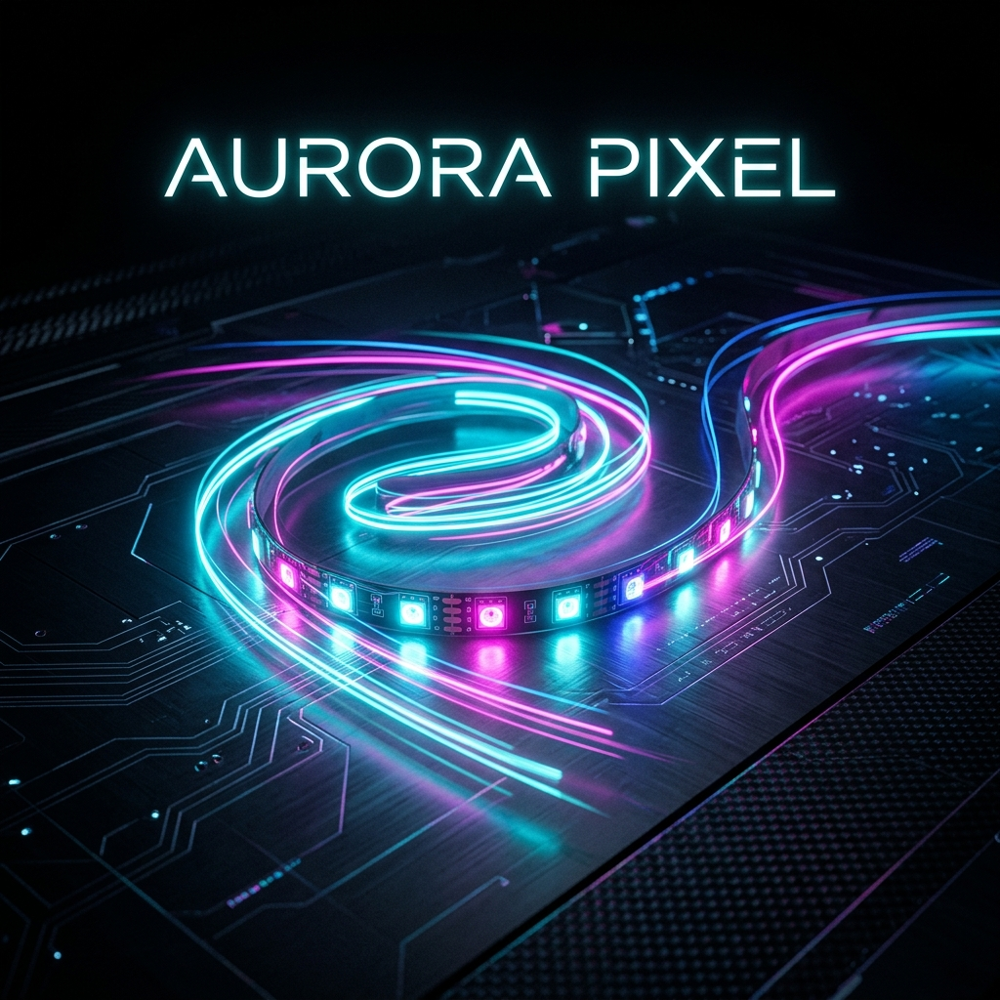
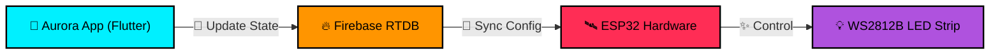

<p align="center">
  
</p>

# 🌌 Aurora Pixel Controller
### Premium Cyberpunk LED Experience for ESP32 & WS2812B

[](https://github.com/kiran-embedded)
[](LICENSE)
[](https://flutter.dev)

**Aurora Pixel Controller** is a high-end, AMOLED-optimized Flutter application designed to remotely control WS2812B LED strips via an ESP32 microcontroller and Firebase Realtime Database. Featuring a sleek Cyberpunk aesthetic, it provides an immersive interface for toggling animations, fine-tuning colors, and simulating real-time audio-reactive VU meter effects.

---

## ⚡ Key Features

- **💎 Elite Cyberpunk UI**: A hyper-premium, non-scrollable glassmorphism design optimized for AMOLED displays.
- **🎭 Dual Engine Experience**:
  - **Pixel FX**: 12+ meticulously designed animations including Meteor Shower, Aurora Borealis, and Neon Breath.
  - **Audio React (VU Meter)**: Multiple audio-reactive modes like Gravity Drop and Digital Wave, designed to sync with your environment.
- **🛰️ Remote Control (Firebase)**: True cloud-based control. Change your lights from anywhere with zero local network configuration.
- **📟 Real-time Simulation**: An in-app high-fidelity LED strip simulator with specular diode highlights and staggered animations.
- **🎨 Spectral Hub**: Precise color control via a custom Hue-rotation engine and Hex-precision input.
- **📡 Modern Tech Stack**: Built with Flutter for multi-platform performance and ESP32 for robust hardware control.

---

## 🛠️ System Architecture



---

## 🚀 Getting Started

### Prerequisites
- **Flutter SDK**: Installed and configured.
- **Firebase Project**: A Realtime Database instance setup.
- **ESP32 Hardware**: Configured to read from your Firebase JSON tree.

### Installation
1.  **Clone the Repository**:
    ```bash
    git clone https://github.com/kiran-embedded/pixel_controller.git
    cd pixel_controller
    ```
2.  **Install Dependencies**:
    ```bash
    flutter pub get
    ```
3.  **Configure Firebase**:
    - Place your `google-services.json` (Android) or `GoogleService-Info.plist` (iOS) in the respective platform folders.
    - Update the initialization logic in `lib/main.dart` if needed.
4.  **Run the App**:
    ```bash
    flutter run
    ```

---

## 🚧 Roadmap

- [ ] **Scene Presets**: Save and load custom lighting environments.
- [ ] **Schedule Engine**: Automate light transitions based on time of day.
- [ ] **OTA Updates**: Update ESP32 firmware directly from the mobile app.
- [ ] **Native Music Sync**: Use phone microphone for local VU meter processing.

---

## 👨‍💻 Author

Created with ❤️ by **[kiran-embedded](https://github.com/kiran-embedded)**

> [!NOTE]  
> This project is currently in **Beta (v1.0.0)**. We are actively working on finalizing the hardware bridge and documentation.

## 📄 License

Distributed under the MIT License. See `LICENSE` for more information.
